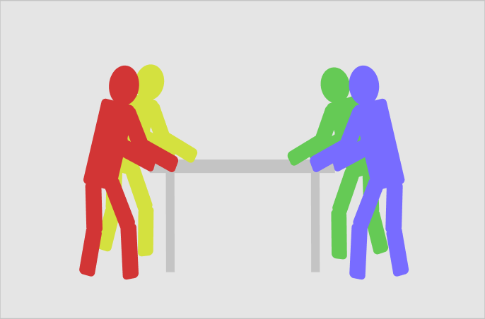
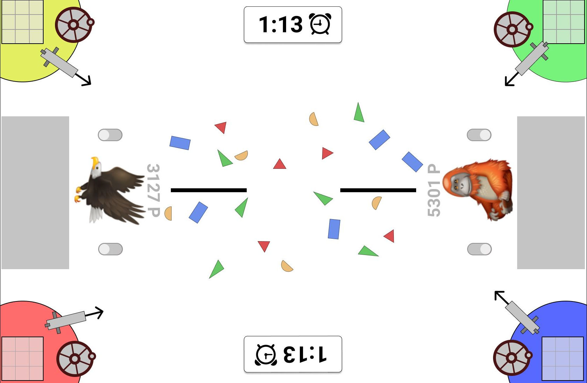

::: block
*Software-Engineering II SS2020* {style=background:red;width:600px;color:white}
::: 

Shapemoji

Action für den Tag der Technik

---

### Informationstechnische Studiengänge der Hochschule Stralsund

- freie Studienplätze
- hohe Abbrecherquote
- geringer Anteil weiblicher Studierender

--

### Wie gewinnt man geeignete Studenten?

- Hausmessen
- Campustag
- Tag der Technik

--

### Zielgruppe 

- Schüler der Mittel- und Oberstufen
- Azubi mit Studienambitionen

--

### Zielgruppenanalyse [S1]

- 35% unentschlossen bzgl Zeit nach Abitur 
- <15% Studiengang gewählt 
- 35% entscheiden nach Interesse / Fähigkeiten
- 14% Selbstverwirklichung
- \>50% warten auf Impuls [S2]

--

### Zielgruppe ansprechen

- Computerspiel weit verbreitestes Hobby in Zielgruppe [S4][S5]
- Smartphone und Sozialmedia

--

### Touchspiel

- Interaktiver Multiplayer
- Actiongeladen
- Touchbasiert
- Kollaborativ
- Kompetitiv

---

# Shapemoji

--

## Shapemoji

  

- Multitouch Tisch
- 1-4 Spieler
- 2 Teams
- Emoji als Generationsmerkmal
