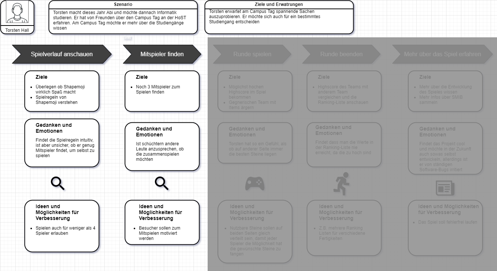
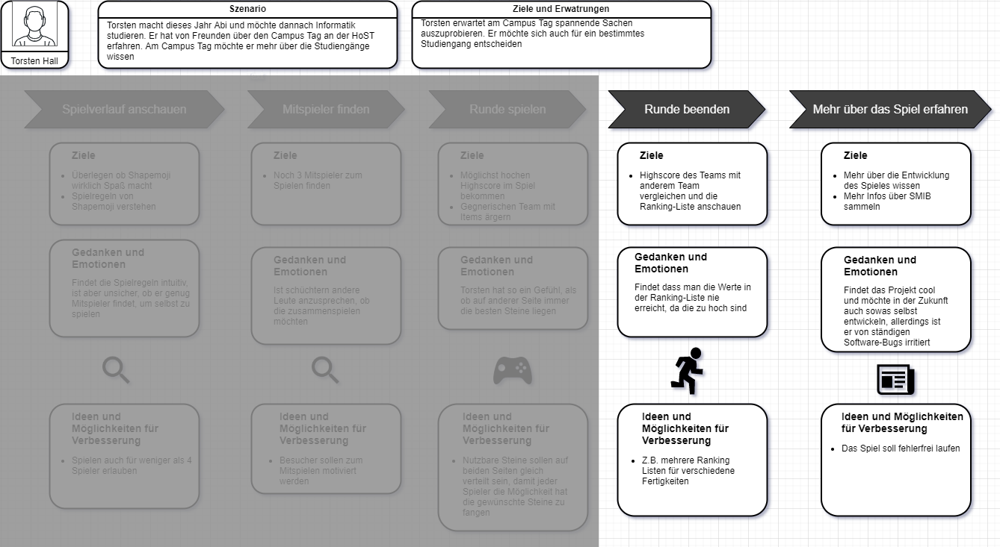
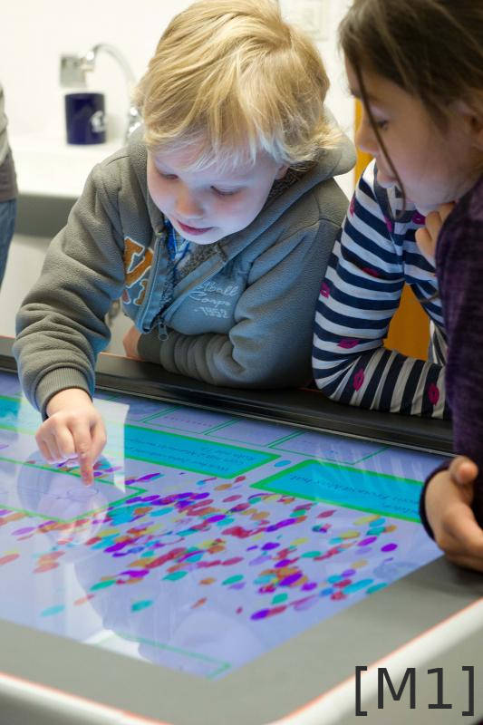
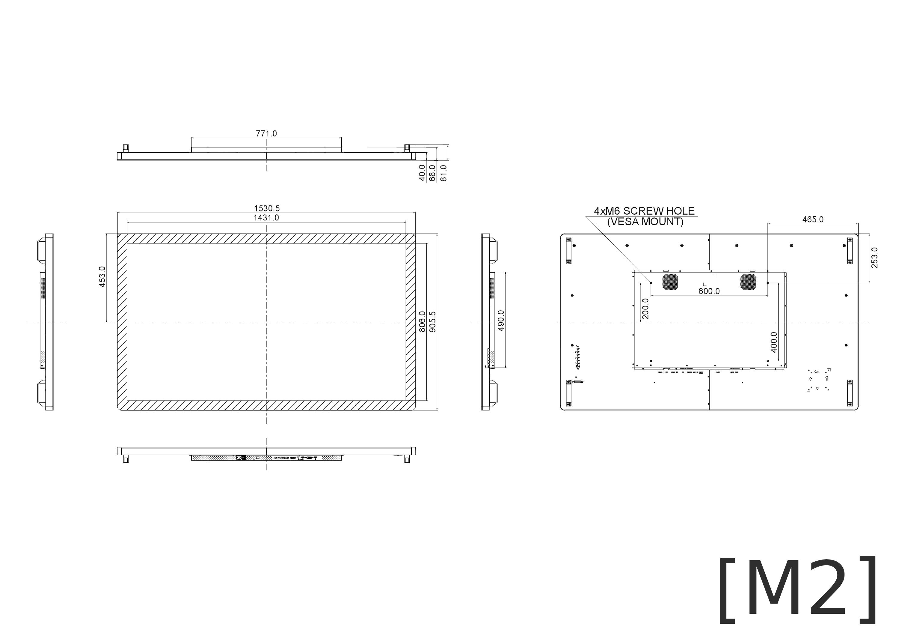
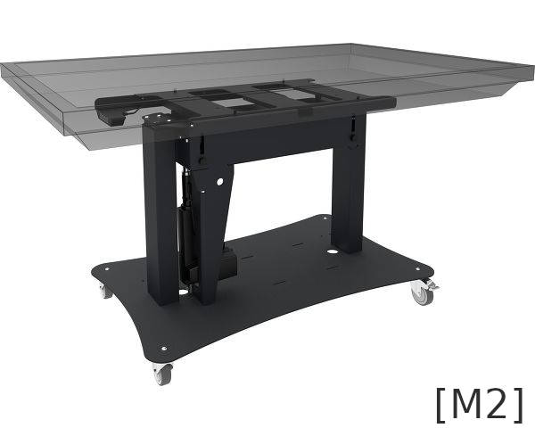

::: block
*Studentisches Projekt* {style=background:red;width:400px;color:white}
::: 

Shapemoji

Action für den Tag der Technik

---

### Informationstechnische Studiengänge der Hochschule Stralsund

- freie Studienplätze
- hohe Abbrecherquote
- geringer Anteil weiblicher Studierender

--

### Wie gewinnt man geeignete Studenten?

- Hausmessen
- Campustag
- Tag der Technik

--

## Zielgruppe 

- Schüler der Mittel- und Oberstufen
- Azubi mit Studienambitionen

--

## Zielgruppenanalyse [S1]

- 35% unentschlossen bzgl Zeit nach Abitur 
- <15% Studiengang gewählt 
- 35% entscheiden nach Interesse / Fähigkeiten
- 14% Selbstverwirklichung
- \>50% warten auf Impuls [S2]

--

## Zielgruppe ansprechen

- Computerspiel weit verbreitestes Hobby in Zielgruppe [S4][S5]
- Smartphone und Sozialmedia

--

## Touchspiel

- Interaktiver Multiplayer
- Actiongeladen
- Touchbasiert
- Kollaborativ
- Kompetitiv

---

# Shapemoji

--

## Shapemoji

  

- Multitouch Tisch
- 1-4 Spieler
- 2 Teams
- Emoji als Generationsmerkmal
- Techniken des Studiengangs

---

### Ein Messebesuch aus Sicht von Torsten

--

### Ein Messebesuch aus Sicht von Torsten

<video width="90%" controls>
  <source src="vid/shapemoji_spielablauf.mp4">
  Your browser does not support the video tag.
</video>

--

### Ein Messebesuch aus Sicht von Torsten

<video width="90%" controls>
  <source src="vid/shapemoji_freezitem.mp4">
  Your browser does not support the video tag.
</video>

--

### Ein Messebesuch aus Sicht von Torsten

--

## Anhaltenede Spielermotivation

- Ultra Casual Gaming
- Highscores
- Interaktion
- Minierfolge

---

## Der Aufbau: Setting

- Prominente Präsentation
- Public Viewing des Spiels
- Plakatwerbung für Tunier

--

## Der Aufbau: Hardware

- Aufbau als Touchtisch
- 65" (145x80)cm
- Stabile Glasoberfläche
- Kompakt verstaubar
- Stabiles Gestell
- Blickwinkelstabil
- Hohe Auflösung

--

## Der Aufbau: Hardware

 

---

## Shapemoji

- Action für den Tag der Technik
- Event-Charakter
- Impuls zur Studienwahl

    <video width="100%" controls>
        <source src="vid/zusammenschnitt.mp4">
         Your browser does not support the video tag.
    </video>

---

## Quellen

::: block

[[M1] Ladel Online: Multitouch im Unterricht, abg. Juli 2020](https://www.ladel-online.net/de/multi-touch-tisch-im-unterricht)

[[M2] IIyama, abg. Juli 2020](https://iiyama.com/de_de/produkte/md-062b7650/)

[\[S1\] Nach-dem-Abitur.de: *Umfrage 2016*, abg. 17.4.20](
https://www.nach-dem-abitur.de/umfragen-nach-dem-abitur-ergebnisse)

[\[S2\] Deutsche Bildung: *SchulhofBarometer2017*, abg. 17.4.20](
https://www.deutsche-bildung.de/fileadmin/Dokumente/SchulhofBarometer_2017.pdf)

[\[S3\] Statista: *Geschlechterverteilung im Informatik Studium 2020*, abg. 20.4.20](
https://de.statista.com/statistik/daten/studie/732331/umfrage/studierende-im-fach-informatik-in-deutschland-nach-geschlecht/)

[\[S4\] Statista: *Altersverteilung Gamer in Deutschland 2020*, abg. 19.4.20](
https://de.statista.com/statistik/daten/studie/198202/umfrage/altersverteilung-von-gamern-in-deutschland-in-absoluten-zahlen/)

[\[S5\] Statista: *Bevölkerung - Zahl der Einwohner in Deutschland nach Altersgruppen 2019*, abg. 19.4.20](
https://de.statista.com/statistik/daten/studie/1365/umfrage/bevoelkerung-deutschlands-nach-altersgruppen/)

[\[S6\] Statista: *Anzahl der Schüler/innen an allgemeinbildenden und beruflichen Schulen in D 2020*, abg. 20.4.20](
https://de.statista.com/statistik/daten/studie/981823/umfrage/anzahl-der-schueler-an-allgemeinbildenden-schulen/)

{style=text-align:left;font-size:50%}
:::