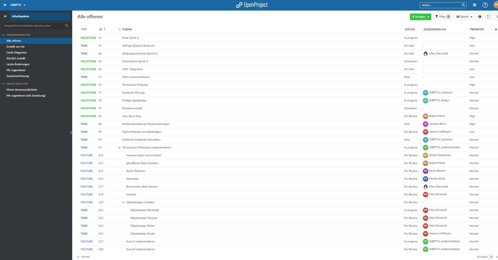
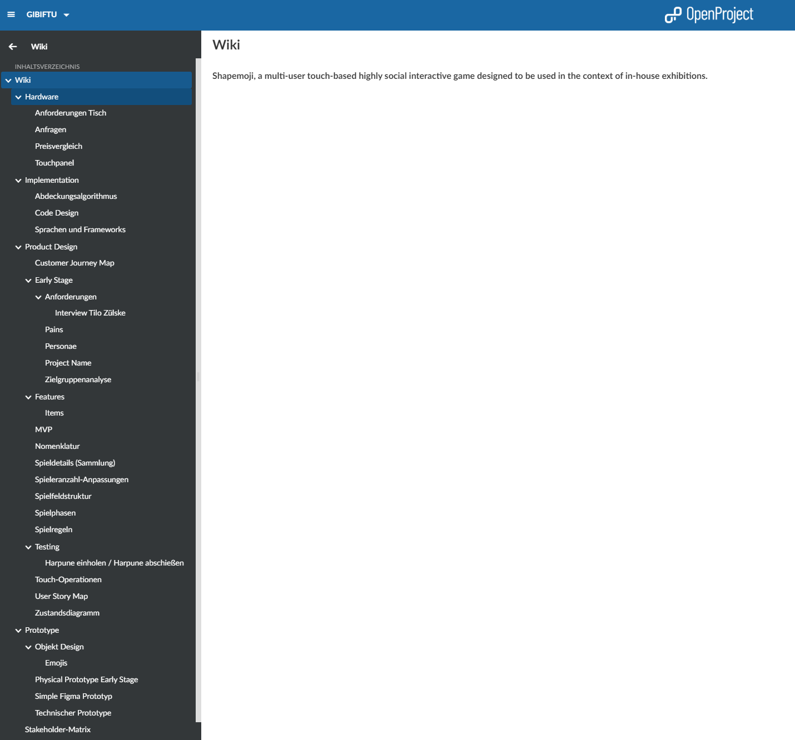
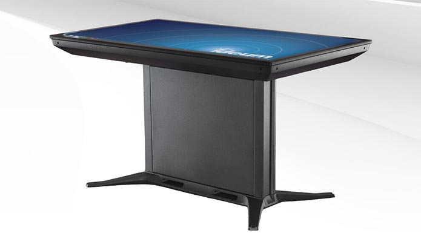
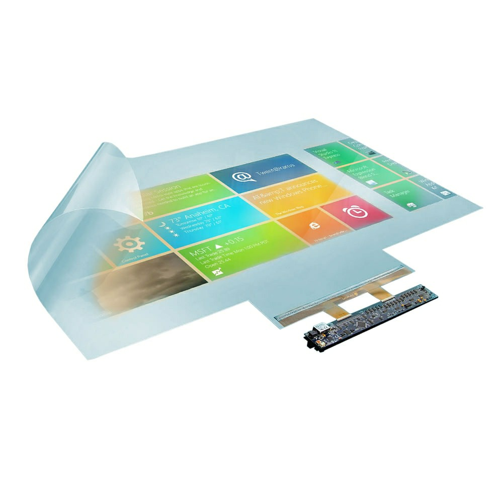
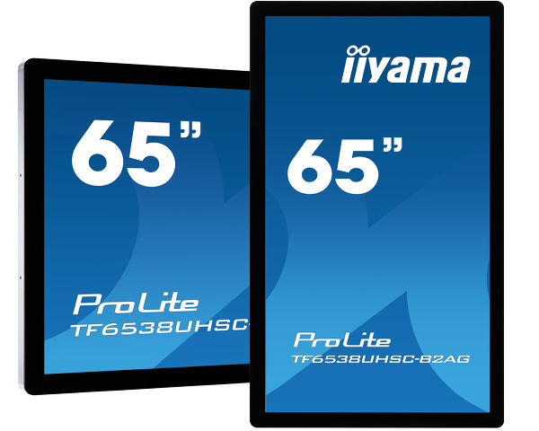
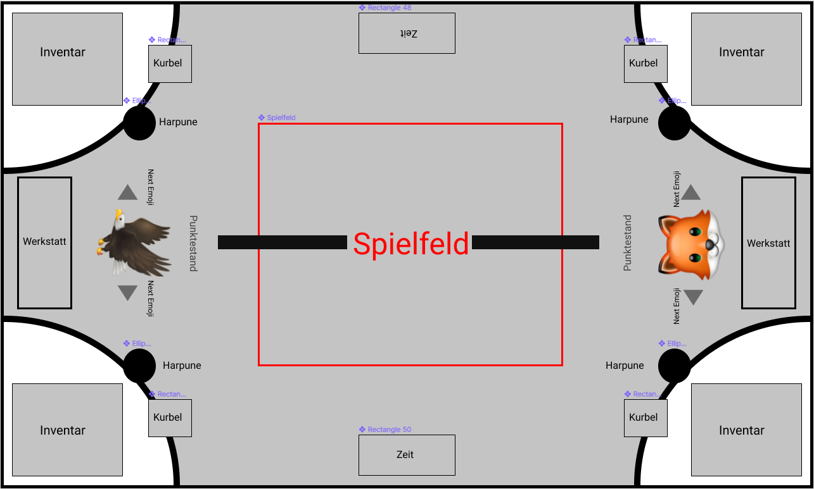
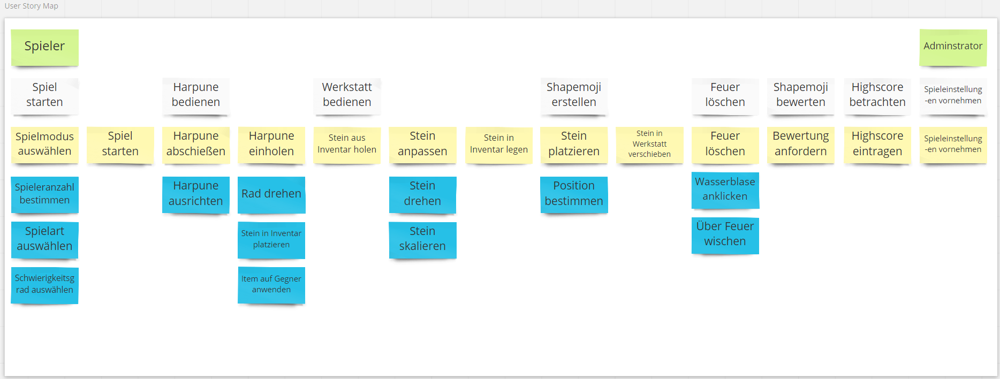
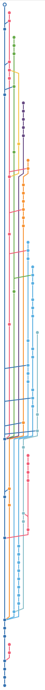

::: block
*Software-Engineering II SS2020* {style=background:red;width:600px;color:white}
::: 

Shapemoji

Action für den Tag der Technik

---

# Vorgehensweise

---

## Verzeichnis
<ol>
    <li>Teamstruktur</li>
    <li>Tools</li>
    <li>Chronologie</li>
    <li>Ergebnisse</li>
    <ol>
        <li>Hardware</li>
        <li>Design</li>
        <li>Implementation</li>
    </ol>
    <li>Weitere Punkte</li>
</ol>

---

# Teamstruktur

--

## Teamleitung
- Marc Marschall

--

## Team 1
- Design
- Mitglieder: 
    - Max Schwerdt
    - Robert Meier (Teamleiter)
    - Hannes Hoffmann
    - Andrei Dziubenka
    - Jacques Berry

--

## Team 2
- Hardware
- Mitglieder:
    - Max Schwerdt
    - Marc Marschall
    - Florian Kluth
    - Kevin Bücher (Teamleiter)
    - Jacques Berry

--

## Team 3
- Implementation
- Mitglieder:
    - Hannes Hoffmann (Teamleiter)
    - Max Schwerdt
    - Marc Marschall
    - Robert Meier
    - Andrei Dziubenka
    - Florian Kluth
    - Jacques Berry

---

# Tools

--

## Open Project
- Werkzeug der Projektplanung
- Enthält:
    - Kalender
    - Tasks
        - Milestones
        - Features
        - Task
    - Wiki
    - Integration mit GitHub
    - Besprechungen
        - Agenda
        - Protokoll

--

## Tasks

--

## Tasks

--

## Wiki

--

## Meetings
- Arten
    - alle Gruppenmitglieder
    - Teams
    - individuell
- [Besprechnung](https://openproject.msl-services.de/projects/gibiftu/meetings) in OpenProject

---

## Chronologie
- Phase 1: Zusammenführung der Ergebnisse
- Phase 2: Arbeit in Gruppen
- Phase 3: Zusammenführung und Außendarstellung erarbeiten

---

# Ergebnisse

---

# Hardware

--

## Anforderungen

- Verstaubarkeit
- Schneller/Einfacher Aufbau
- Wartbarkeit
- Außreichende Stabilität (spontanes Auflehnen)
- Transportierbarkeit
- durch Türen passend

--

## Mögliche Konzepte

### Touchtisch 

--

#### Probleme mit Touchtischen

- nur B2B
- Preis meist über Budget
- Schutzrechtliche Einschränkungen

--

### Touchfolie 

--

### Probleme mit Touchfolien

- fast keine deutschen Anbieter
- Eigenbau schwierig -> Stabilität weniger gegeben
- Glasplatte muss extra besorgt werden
- Gesamtsumme knapp unterm Budget

--

### Touchpanel 

--

### Warum Touchpanel?

- Preis des Panels bei knapp 4700€
- Eigenbau umfasst nur Gestell -> preislich recht günstig
- hohe Stabilität + bessere Wartbarkeit
- Gesamtsumme bei ca. 6000 - 7000€
---

# Design

--

## Spielfeldaufbau

--

## Testing
- Spielkonzept
- Werkstatt
- Anzahl Steine auf dem Spielfeld
- Button Abgabe Shapemoji
- Harpune
    - abschießen
    - einholen

--

## Items
- Defekt
- Feuer-Harpune
- Windstoß
- Tauscher

--

## Objektdesigns

--

## User Story Map

--

## Spielmodi
- 2 gegen 2
- 2 gegen 1
- 1 gegen 1
- 4 gegen die Zeit
- 3 gegen die Zeit
- 2 gegen die Zeit
- 1 gegen die Zeit

--

## Spielmodi
2 gegen 1

---

## Implementation

--

## Wahl des Frameworks
- zunächst Recherche zu Sprachen und Frameworks
- Zur Auswahl standen anschließend:
    - Unity
    - Godot
    - Java Slick2D
    - Cocos2D

--

## Unity
- Vorteile
    - für 2D und 3D Spiele
    - Lizenzfrei
    - große Community und Asset Store
    - gut Dokumentiert
- Nachteile
    - Programmierung in C# (den meisten unbekannt)

--

## Coding
- Code Design Regeln
- Git
    - [GitHub-Repository](https://github.com/worksasintended/shapemoji_protoype)
    - Teamaufteilung (Szenen)
    - Pull Requests
    - Double Reviews

--

<iframe allowfullscreen="true" src="https://www.easyzoom.com/embed/8043f042204949889e3122acdeb82fea" width="150" height="600">

</iframe>
<!-- TODO resize image></!-->
--

## Technischer Prototyp
<video controls>
    <source src="video/shapemoji_technical_prototype.mp4">
</video>

---

## Weitere Punkte

- [Abdeckalgorithmus](https://openproject.msl-services.de/projects/gibiftu/wiki/abdeckungsalgorithmus)
- [Zustandsdiagramm](https://openproject.msl-services.de/projects/gibiftu/wiki/zustandsdiagramm)
- [Personas neu definiert](https://openproject.msl-services.de/projects/gibiftu/wiki/personae)
- [MVP](https://openproject.msl-services.de/projects/gibiftu/wiki/mvp) definiert
- [Touch Operationen](https://openproject.msl-services.de/projects/gibiftu/wiki/touch-operationen)
- [Stakeholder-Matrix](https://openproject.msl-services.de/projects/gibiftu/wiki/stakeholder-matrix)

---

# Projektfazit

--

## Projektfazit
- Organisation über Open Project
- Einteilung in 3 Teams
- Hardware für etwa 7000€
- Design aus zweiten Sprint verfeinert
- Technische Prototyp (mit Unity)
